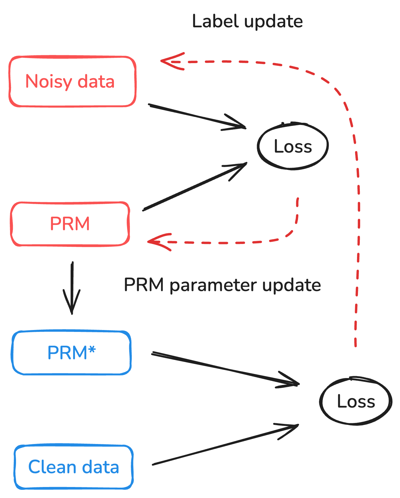

# DreamPRM-Code  

- **Process Reward Modeling for Code via Chain-of-Functions and Meta Label Correction**


[📄 Paper] 

---

## 🔍 Overview

DreamPRM-Code is a coding-focused Process Reward Model that enables reliable test-time scaling and RLHF for program synthesis. It resolves the two main blockers for coding PRMs—missing step decompositions and noisy intermediate labels—by scoring reasoning at the **function** level and denoising Monte-Carlo supervision with meta-learning guided by unit-test outcomes. This turns functions into natural PRM steps, aligns with software-engineering abstractions, and keeps inference tractable.

### Key Mechanics

#### 1. Chain-of-Functions prompting
DreamPRM-Code steers the policy model to outline high-level strategies, core algorithms, and helper utilities as separate functions so the PRM can judge coherent steps instead of individual lines or natural-language plans.

<details>
<summary><strong>Example CoF prompt</strong></summary>

```python
(Step-1)
def main():
    '''
    Strategy: Use Dijkstra's algorithm to find the shortest path...
    '''
    # implementation

(Step-2)
def dijkstra(graph, start, end):
    '''
    Implements Dijkstra's algorithm with a min-heap priority queue...
    '''
    # implementation

(Step-3)
def build_graph(n, m):
    '''
    Build adjacency list from stdin input...
    '''
    # implementation
```
</details>

#### 2. Meta-learning label correction
Noisy per-function labels are treated as learnable variables and refined via a bi-level optimizer (Betty) that is anchored by clean unit-test rewards, producing more faithful intermediate supervision.

<figure>
  
  <figcaption align="center"><sub>Meta-learning denoises Monte-Carlo labels with unit-test anchors.</sub></figcaption>
</figure>

#### 3. Experimental setup
LiveCodeBench (pre-2024-08 training / post-2025-02 test) provides the benchmark split, OpenAI o4-mini-high serves as the policy, and Qwen-2.5-Coder-3B functions as the classifier head–based PRM.

#### 📊 Benchmark performance

<div align="center">

<table>
  <thead>
    <tr>
      <th>Method</th>
      <th>Easy</th>
      <th>Medium</th>
      <th>Hard</th>
      <th>Overall</th>
    </tr>
  </thead>
  <tbody>
    <tr>
      <td>Gemini-2.5</td>
      <td><strong>100</strong></td>
      <td>82.1</td>
      <td>52.5</td>
      <td>72.5</td>
    </tr>
    <tr>
      <td>O3</td>
      <td><strong>100</strong></td>
      <td>71.8</td>
      <td>57.4</td>
      <td>71.8</td>
    </tr>
    <tr>
      <td>DeepSeek-R1</td>
      <td>99.7</td>
      <td>77.7</td>
      <td>47.2</td>
      <td>68.7</td>
    </tr>
    <tr>
      <td>O4-mini-high</td>
      <td><strong>100</strong></td>
      <td>89.7</td>
      <td>57.4</td>
      <td>77.1</td>
    </tr>
    <tr>
      <td>ORM (o4-mini-high)</td>
      <td><strong>100</strong></td>
      <td>89.7</td>
      <td>62.3</td>
      <td>79.4</td>
    </tr>
    <tr>
      <td>PRM (CoF)</td>
      <td><strong>100</strong></td>
      <td><strong>92.3</strong></td>
      <td>62.3</td>
      <td>80.2</td>
    </tr>
    <tr>
      <td><strong>DreamPRM-Code</strong></td>
      <td><strong>100</strong></td>
      <td><strong>92.3</strong></td>
      <td><strong>63.9</strong></td>
      <td><strong>80.9</strong></td>
    </tr>
  </tbody>
</table>

</div>

---

## 🚀 Quick Start

This section provides a minimal end-to-end guide for running **DreamPRM-Code**, from data generation to training and evaluation.

---

### 1️⃣ Clone the Repository and Set Up Environment

First, clone the repository and create the conda environment using the provided `environment.yml` file:

    git clone https://github.com/ruz048/DreamPRM-Code.git
    cd DreamPRM-Code
    conda env create -f environment.yml
    conda activate dreamprm-code

---

### 2️⃣ Generate Chain-of-Functions (CoF) Training Data

DreamPRM-Code relies on **Chain-of-Functions (CoF)**–structured code as PRM training data.

Use the following script to generate CoF-style code solutions from the base LLM:

    bash gen_cof.sh

This step produces **function-structured code traces** that define PRM reasoning steps.  
At this stage, the generated data **does not contain reward labels**.

---

### 3️⃣ Monte-Carlo Label Generation

To obtain initial supervision for PRM training, we perform **Monte-Carlo (MC) sampling** to assign noisy correctness labels to intermediate CoF steps:

    bash gen_cof_label.sh

These labels serve as the starting point for training and will later be **automatically refined** by the meta-learning–based label correction framework.

---

### 4️⃣ Meta-Learning–Based Training and Evaluation

With CoF data and MC-sampled labels prepared, you can start training DreamPRM-Code using the bi-level optimization framework:

    bash run_train_eval.sh

This script:
- Trains the PRM on function-level steps
- Performs meta-learning–based label correction
- Automatically evaluates performance during training

---

### 5️⃣ Evaluation with a Trained Checkpoint

If you already have a trained DreamPRM-Code checkpoint, you can directly run evaluation without retraining:

    bash run_eval.sh

This evaluates the PRM under test-time scaling settings on the specified benchmark.

Pretrained checkpoint: [DreamPRM-Code (Google Drive)](https://drive.google.com/file/d/1mt4BzB9laiO7yDHVip0TFSVWOEeUBRB1/view?usp=sharing)

---

### 📌 Notes

- Ensure the correct base (policy) model and paths are configured in the scripts before running.
- Generated intermediate labels are intentionally noisy and are refined during meta-learning.
- Evaluation results are automatically logged for comparison across runs.


## 📌 Citation

If you find this work useful, please cite:

    @article{zhang2025dreamprmcode,
    title   = {DreamPRM-Code: Function-as-Step Process Reward Model for LLM Coding},
    author  = {Zhang, Ruiyi and Qin, Peijia and Cao, Qi and Xie, Pengtao},
    journal = {arXiv preprint},
    year    = {2025}
    }

---

## 📬 Contact

For questions or collaborations, please contact ruz048@ucsd.edu 
